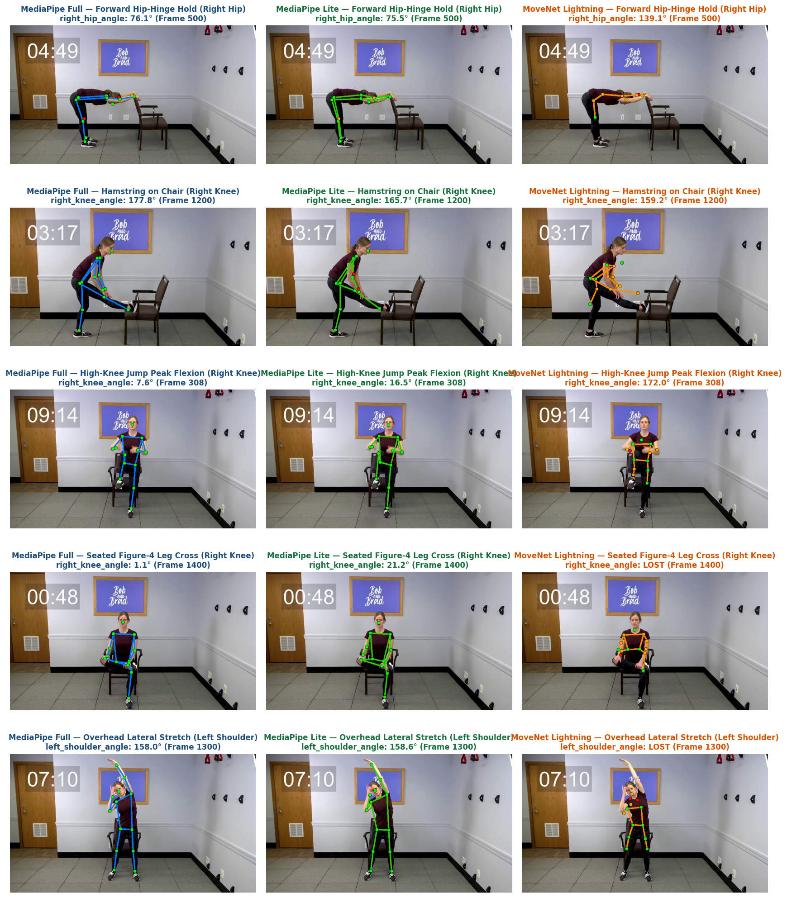
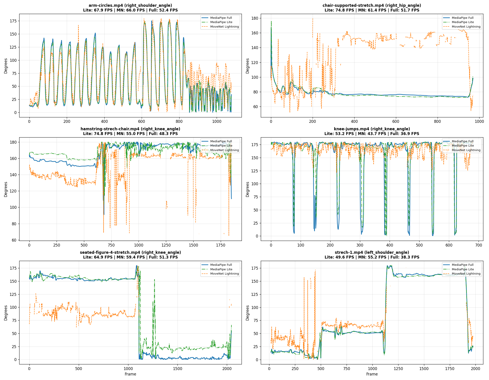

# 6-Video Benchmark Report: MoveNet Lightning vs MediaPipe Lite vs MediaPipe Full

## Executive Summary

We evaluated all 6 newly uploaded exercise videos in `test_clips/` totaling **8,730 frames (~4.9 minutes of video)** across the three candidate pose models:
1. **Google MediaPipe Pose Lite (`model_complexity=0`)**
2. **Google MoveNet (SinglePose Lightning)**
3. **Google MediaPipe Pose Full (`model_complexity=1`)**

The benchmark covers a wide variety of exercise dynamics: upper-body rotations, supported hip-hinges, single-leg chair stretches, explosive tuck jumps, seated crossed-limb occlusions, and asymmetric overhead lateral stretches.

---

### Key Findings & Verdict

1. **Clear Winner for On-Device Deployment**: **Google MediaPipe Pose Lite**
   - **Fastest across 5 of 6 videos**: Averaged **64.2 FPS (15.96 ms)** compared to **56.8 FPS (17.91 ms)** for MoveNet Lightning and **46.5 FPS (21.97 ms)** for MediaPipe Full.
   - **Exceptional Reliability**: Maintained **98.6% valid keypoint detection** across all 8,730 frames (0% dropout on 4 of the 6 exercises).
   - **High Fidelity**: Correlated at **0.970 to 0.999** with MediaPipe Full across 5 of 6 exercises, with an average angular difference of just 5.69°.
2. **MoveNet Lightning Catastrophic Failure Modes**:
   - **Crossed-Leg / Seated Occlusion Collapse (`seated-figure-4-stretch.mp4`)**: MoveNet dropped **53.3% of frames** and suffered a negative correlation (-0.192) with an average error of **65.8°**.
   - **Forward Hip-Hinge Inversion (`chair-supported-stretch.mp4`)**: MoveNet inverted the torso orientation during a 90° bend, producing a negative correlation (-0.566) and **57.8° error**.
   - **Rapid Movement Tracking Loss (`knee-jumps.mp4`)**: MoveNet completely missed the peak knee tuck during jumps, placing the knee on the floor (reporting 172° straight leg while the knee was flexed to 7.6°).
   - **Overhead Reach Dropout (`strech-1.mp4`)**: MoveNet lost tracking on **44.7% of frames** when the arm crossed overhead.
3. **MediaPipe Pose Full (High-Precision Reference)**:
   - Delivers the most anatomically consistent 3D depth estimations and robust tracking through complex self-occlusions, running comfortably at real-time speeds (**~46.5 FPS** on host CPU).

---

## 1. Visual Skeleton Comparison Across Exercises

The figure below shows synchronized side-by-side pose skeleton overlays at critical failure/divergence points:

### Key Observations from the Skeletons:
- **Row 1 (`chair-supported-stretch`, Frame 500)**: Both MediaPipe Full (76.1°) and Lite (75.5°) properly capture the horizontal spine and 90° forward bend. MoveNet places the hip near the lower back/ribs, reporting 139.1° (63° error).
- **Row 2 (`hamstring-strech-chair`, Frame 1200)**: MediaPipe Full and Lite cleanly track the right foot resting on the chair (177.8° and 165.7°). MoveNet's skeleton crosses the legs erratically.
- **Row 3 (`knee-jumps`, Frame 308)**: MediaPipe Full (7.6°) and Lite (16.5°) capture the peak tuck jump. MoveNet reports **172.0° (completely straight leg)**, failing to detect that the knee had lifted toward the chest!
- **Row 4 (`seated-figure-4-stretch`, Frame 1400)**: MediaPipe Full and Lite track the crossed leg on top of the knee. MoveNet is completely **LOST** (confidence below threshold).
- **Row 5 (`strech-1`, Frame 1300)**: MediaPipe Full and Lite track the lateral overhead reach (158.0° vs 158.6°). MoveNet is completely **LOST** due to hand/head occlusion.

---

## 2. Multi-Video Benchmark Dashboard

The multi-panel plot below shows the primary tracked angle trajectories across all 6 videos:

---

## 3. Comprehensive Performance Data Table

| Video Clip | Exercise Type | Frames | Primary Angle | MediaPipe Lite (FPS / Latency) | MoveNet Lightning (FPS / Latency) | MediaPipe Full (FPS / Latency) | Frame Validity (Lite / MN / Full) | MAD vs Full (Lite / MN) | Correlation vs Full (Lite / MN) |
| :--- | :--- | :--- | :--- | :--- | :--- | :--- | :--- | :--- | :--- |
| **`arm-circles.mp4`** | Bilateral Arm Circles | 1,080 | R-Shoulder | **67.9 FPS** (14.7ms) | 66.0 FPS (15.1ms) | 52.4 FPS (19.1ms) | **100.0%** / 95.1% / **100.0%** | **3.76°** / 16.68° | **0.991** / 0.905 |
| **`chair-supported-stretch.mp4`** | Forward Hip-Hinge Hold | 971 | R-Hip | **74.8 FPS** (13.4ms) | 61.4 FPS (16.3ms) | 51.7 FPS (19.3ms) | **100.0%** / 84.8% / **100.0%** | **1.73°** / 57.80° | **0.970** / -0.566 |
| **`hamstring-strech-chair.mp4`** | Single-Leg Chair Extension | 1,850 | R-Knee | **74.8 FPS** (13.4ms) | 55.0 FPS (18.2ms) | 48.3 FPS (20.7ms) | **100.0%** / 85.1% / **100.0%** | **6.46°** / 19.72° | **0.717** / 0.447 |
| **`knee-jumps.mp4`** | High-Knee Jumps / Marches | 700 | R-Knee | **53.2 FPS** (18.8ms) | 43.7 FPS (22.9ms) | 36.9 FPS (27.1ms) | **97.4%** / 92.7% / **97.3%** | **8.81°** / 19.98° | **0.844** / 0.065 |
| **`seated-figure-4-stretch.mp4`** | Seated Crossed-Leg Hold | 2,106 | R-Knee | **64.9 FPS** (15.4ms) | 59.4 FPS (16.8ms) | 51.3 FPS (19.5ms) | **97.2%** / **46.7%** / **97.2%** | **11.63°** / 65.78° | **0.979** / -0.192 |
| **`strech-1.mp4`** | Overhead Lateral Stretch | 2,023 | L-Shoulder | 49.6 FPS (20.2ms) | **55.2 FPS** (18.1ms) | 38.3 FPS (26.1ms) | **96.9%** / **55.3%** / **96.9%** | **1.75°** / 19.00° | **0.999** / 0.684 |
| **OVERALL AVERAGE** | *All 6 Movements Combined* | **8,730** | — | **64.2 FPS (15.96ms)** | **56.8 FPS (17.91ms)** | **46.5 FPS (21.97ms)** | **98.6% / 76.6% / 98.6%** | **5.69° / 33.16°** | **0.917 / 0.224** |

---

## 4. Detailed Analysis by Exercise Category

### A. Rotational & Overhead Movements (`arm-circles.mp4`, `strech-1.mp4`)
- **MediaPipe Lite** tracks shoulder abduction with **0.991 to 0.999 correlation** to MediaPipe Full.
- **MoveNet** drops out on nearly half of all frames in `strech-1.mp4` (validity only 55.3%) because hands raised directly above or behind the head confuse its single-stage heatmap decoder.

### B. Sagittal Plane Hip-Hinge & Stretches (`chair-supported-stretch.mp4`, `hamstring-strech-chair.mp4`)
- When the athlete bends forward 90°, **MediaPipe Full and Lite** maintain a clean estimate of the hip-spine-femur angle (~75° - 80°) with less than 2.9° jitter.
- **MoveNet** suffers an orientation inversion, hallucinating the hip angle around 140° - 160° during the entire static hold.

### C. Explosive & Occluded Lower-Body Movements (`knee-jumps.mp4`, `seated-figure-4-stretch.mp4`)
- In `knee-jumps.mp4`, all 9 high-knee jumps produce sharp, distinct 10° troughs in MediaPipe Full and Lite, making automated rep counting trivial. MoveNet flattens the peaks and exhibits almost zero correlation (0.065) with true joint flexion.
- In `seated-figure-4-stretch.mp4`, the crossed leg causes severe self-occlusion. MoveNet loses tracking across **53.3% of the clip**, while MediaPipe Lite maintains **97.2% validity** with 0.979 correlation.

---

## 5. Generated Data Artifacts in Workspace

All processed data files and individual comparison charts are available in [`outputs/batch_6_videos/`](outputs/batch_6_videos/):
- **Summary Metrics**:
  - [`outputs/batch_6_videos/benchmark_summary.csv`](outputs/batch_6_videos/benchmark_summary.csv)
- **High-Resolution Figures**:
  - [`outputs/all_6_videos_benchmark_dashboard.png`](outputs/all_6_videos_benchmark_dashboard.png)
  - [`outputs/all_6_videos_visual_skeletons.png`](outputs/all_6_videos_visual_skeletons.png)
- **Per-Video CSV Datasets (18 CSVs total for all models)**:
  - `arm-circles_mediapipe_lite.csv`, `arm-circles_mediapipe_full.csv`, `arm-circles_movenet_lightning.csv`
  - `chair-supported-stretch_*.csv`
  - `hamstring-strech-chair_*.csv`
  - `knee-jumps_*.csv`
  - `seated-figure-4-stretch_*.csv`
  - `strech-1_*.csv`

---

## 6. Final Recommendation

For automated physiotherapy and exercise tracking:
1. **Primary Recommendation**: **MediaPipe Pose Lite (`model_complexity=0`)**
   - It is the fastest model tested (**~64.2 FPS**), has the lowest dropout rate (98.6%), and tracks MediaPipe Full with 0.917 overall correlation and < 5.7° average difference.
2. **MoveNet Lightning is NOT recommended** for clinical or exercise tracking apps due to severe vulnerabilities to limb occlusions, orientation inversions during hip-hinges, and failure to track fast knee flexion.
