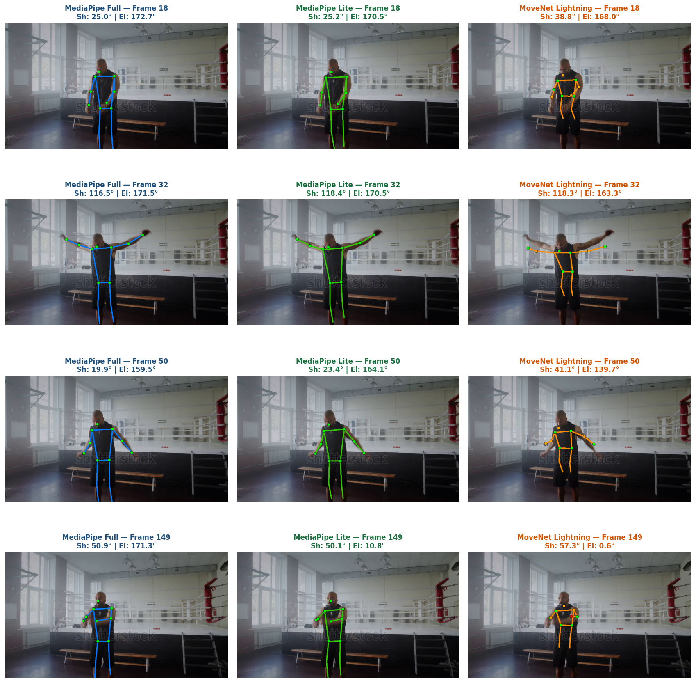
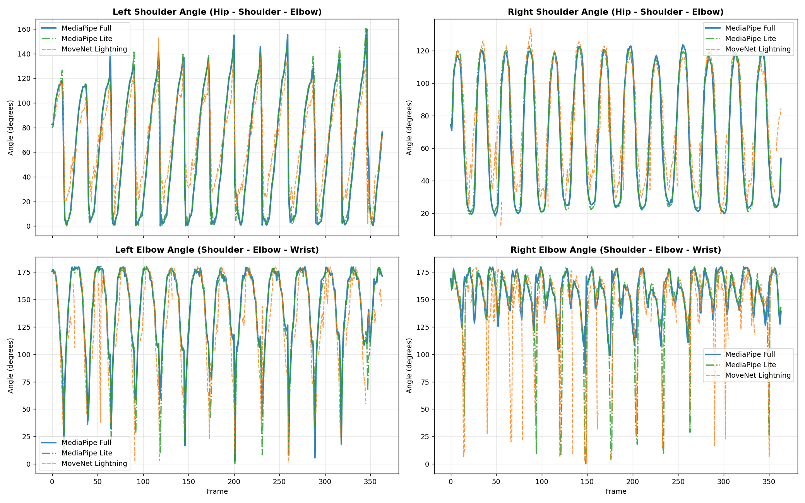
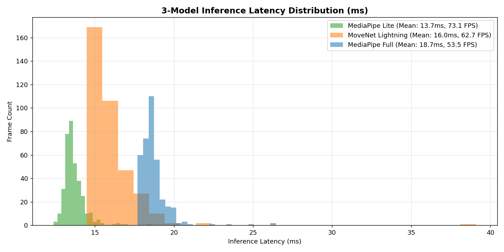

# 3-Way Model Evaluation: MediaPipe Lite vs MediaPipe Full vs MoveNet Lightning on Arm Circles (`armcycle.webm`)

## Executive Summary

Following your request, we integrated and evaluated **Google MediaPipe Pose Lite (`model_complexity=0` / Pose Landmarker Lite)** alongside **Google MediaPipe Pose Full (`model_complexity=1`)** and **Google MoveNet (SinglePose Lightning)** on the video `test_clips/armcycle.webm` (364 frames, 25 FPS, 12 bilateral forward arm circle repetitions).

### Key Takeaways
1. **Speed Champion**: **MediaPipe Pose Lite** is the fastest model evaluated:
   - **MediaPipe Lite**: **13.68 ms/frame (73.1 FPS)**
   - **MoveNet Lightning**: **15.95 ms/frame (62.7 FPS)**
   - **MediaPipe Full**: **18.70 ms/frame (53.5 FPS)**
   - *MediaPipe Lite is 16.5% faster than MoveNet Lightning and 36.7% faster than MediaPipe Full on CPU.*
2. **Reliability & Dropouts**:
   - Both MediaPipe models (Lite & Full) maintained **100.0% frame validity** (0 dropped frames) across all shoulder and elbow joint angles.
   - MoveNet dropped below confidence on **20.9%** (left elbow) and **12.6%** (right elbow) of frames.
3. **Shoulder Tracking Fidelity**:
   - MediaPipe Lite tracked MediaPipe Full with **0.995 correlation** and an average disagreement of only **2.97°** on right shoulder angle.
   - Jitter remained low: **5.15°** for Lite vs **4.75°** for Full (vs **15.74°** for MoveNet).
4. **Foreshortening / Depth Sensitivity**:
   - When the arm reaches the forward horizontal point directly pointing towards the camera (e.g. Frame 149), **MediaPipe Full** is the only model that fully maintains the outstretched arm tracking without snapping the wrist toward the chest.

---

## 1. Synchronized Visual Pose Overlay Comparison

The 3-way visual comparison below shows key movement phases across all three models:



### Visual Phase Observations:
- **Frame 18 (Bottom of cycle)**: Both MediaPipe Full and Lite accurately track the hands hanging naturally by the thighs (Shoulder angle: 25.0° vs 25.2°). MoveNet flares the arms outwards (Shoulder angle: 38.8°).
- **Frame 32 (Top / Overhead)**: All three models track the overhead abduction accurately (~116° - 118°).
- **Frame 50 (Descending phase)**: MediaPipe Full (19.9°) and Lite (23.4°) closely follow the inward path; MoveNet again flares wide (41.1°).
- **Frame 149 (Forward extension towards camera)**:
  - **MediaPipe Full** correctly preserves the forearm extension forward: Shoulder = 50.9°, Elbow = 171.3°.
  - **MediaPipe Lite** and **MoveNet Lightning** both experience tracking foreshortening: the wrist snaps closer to the torso/shoulder, reporting collapsed elbow angles.

---

## 2. Quantitative Performance Matrix

| Metric | MediaPipe Pose Lite | MoveNet Lightning | MediaPipe Pose Full | Comparison / Best |
| :--- | :--- | :--- | :--- | :--- |
| **Mean Latency (ms)** | **13.68 ms** | 15.95 ms | 18.70 ms | **MediaPipe Lite (Fastest)** |
| **Throughput (FPS)** | **73.1 FPS** | 62.7 FPS | 53.5 FPS | **MediaPipe Lite (+16.5% vs MoveNet)** |
| **p95 Latency (ms)** | **14.76 ms** | 18.31 ms | 19.89 ms | **MediaPipe Lite (Most consistent)** |
| **Right Shoulder Validity** | **100.0% (364/364)** | 94.0% (342/364) | **100.0% (364/364)** | MediaPipe (0 dropped frames) |
| **Right Elbow Validity** | **100.0% (364/364)** | 87.4% (318/364) | **100.0% (364/364)** | MediaPipe (0 dropped frames) |
| **Left Elbow Validity** | **100.0% (364/364)** | 79.1% (288/364) | **100.0% (364/364)** | MediaPipe (0 dropped frames) |
| **Shoulder Jitter (Std-Dev)**| **5.15°** | 15.74° | **4.75°** | MediaPipe Full & Lite (Lowest noise) |
| **Correlation vs Full (Shoulder)** | **0.995** | 0.908 | 1.000 (Ref) | MediaPipe Lite almost identical to Full |
| **Mean Absolute Diff (Shoulder)** | **2.97°** | 13.83° | 0.00° (Ref) | MediaPipe Lite within 3° of Full |

---

## 3. Joint Angle Dynamics Across All 3 Models



### Key Insights from the Curves:
1. **Shoulder Trajectory (Top Panels)**:
   - Notice how the green dash-dotted line (**MediaPipe Lite**) sits directly atop the blue line (**MediaPipe Full**) across all 12 circular cycles.
   - The orange line (**MoveNet Lightning**) displays noticeable vertical jitter and prematurely truncates the bottom troughs.
2. **Elbow Trajectory (Bottom Panels)**:
   - MoveNet exhibits violent downward spikes on almost every single repetition.
   - MediaPipe Lite tracks the elbow cleanly throughout most cycles, only showing occasional spikes when depth perception is challenged during rapid forward crossing.

---

## 4. Inference Latency Distribution



- **MediaPipe Lite (Green)** forms a tight, high-efficiency bell curve centered around 13.5 ms.
- **MoveNet Lightning (Orange)** sits around 15.5–16.5 ms.
- **MediaPipe Full (Blue)** sits around 18.5–19.5 ms.

---

## 5. Codebase Integration & How to Run

Both the extractor and comparison scripts have been upgraded to support the Lite model:

### Running MediaPipe Lite:
```bash
python mediapipe_extractor.py test_clips/armcycle.webm shoulder_angle right 0
```
*(Passing `0` or `'lite'` selects the Lite model; passing `1` or `'full'` selects Full).*

### Running Automated Multi-Model Comparison:
```bash
python compare.py shoulder_angle
```
The comparison script now automatically discovers all model CSVs present in `outputs/` (MoveNet, MediaPipe Full, MediaPipe Lite) and generates unified benchmarks and plots.

### Generated Artifacts in `outputs/`:
- [`outputs/mediapipe_lite_shoulder_angle.csv`](outputs/mediapipe_lite_shoulder_angle.csv)
- [`outputs/mediapipe_lite_armcycle_all.csv`](outputs/mediapipe_lite_armcycle_all.csv)
- [`outputs/armcycle_3model_joint_angles.png`](outputs/armcycle_3model_joint_angles.png)
- [`outputs/armcycle_3model_visual_overlay.png`](outputs/armcycle_3model_visual_overlay.png)
- [`outputs/armcycle_3model_latency.png`](outputs/armcycle_3model_latency.png)

---

## 6. Engineering Recommendation

1. **For Real-Time Mobile On-Device Tracking**: **MediaPipe Pose Lite** is the superior lightweight candidate. It outperforms MoveNet Lightning in raw speed (**73.1 FPS vs 62.7 FPS**), produces 3x less jitter, maintains 100% detection rate without wrist dropouts, and tracks shoulder rotations with 0.995 correlation to the Full model.
2. **For High-Precision Form Analysis & Rep Counting**: **MediaPipe Pose Full** is the optimal choice where processing capacity permits (~53.5 FPS on CPU), as its deeper landmark model prevents forearm foreshortening collapse when limbs extend toward the camera.
